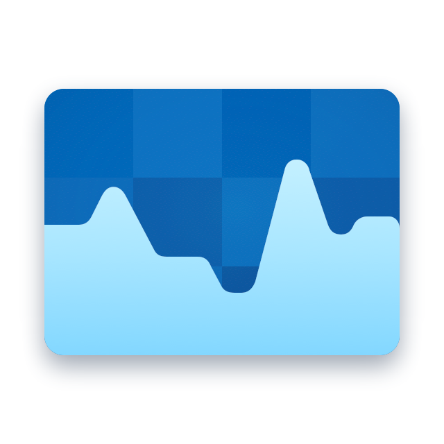
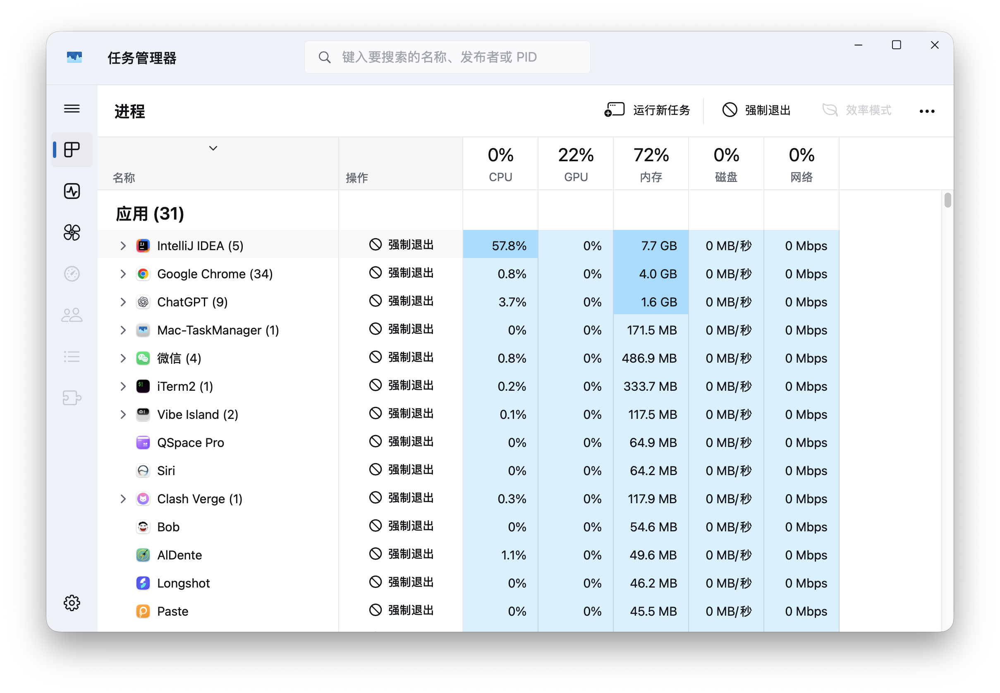

<p align="center">
  
</p>

<h1 align="center">Mac-TaskManager</h1>

<p align="center">
  <strong>给 macOS 的原生任务管理器：看清负载，提前散热，始终把控制权留给你。</strong>
</p>

<p align="center">
  
  
  
  
</p>

<p align="center">
  不是虚拟机，不是远程桌面，也不是套壳网页。<br />
  <strong>Mac-TaskManager</strong> 是一款原生 macOS 应用，用 Windows 任务管理器的高信息密度视图，呈现 Mac 的真实运行状态。
</p>

<p align="center">
  
</p>

---

## 你能得到什么

| 模块 | 不只是“看数据” |
| --- | --- |
| **进程** | 按应用与后台进程分组，展开子进程；实时查看 CPU、GPU、内存、磁盘、网络与 PID；支持搜索、运行新任务、退出或强制退出。 |
| **性能** | 以任务管理器式视图集中呈现系统资源状态，帮助你迅速定位“谁在吃资源”。 |
| **风扇** | 读取 AppleSMC 风扇与温度传感器；手动转速永远钳制在当前硬件报告的安全最小/最大 RPM 之间，可一键交还 macOS 自动控制。 |
| **清凉模式** | 不只按当前温度查表：结合 CPU、GPU、内存、磁盘吞吐、SMC 温度与升温趋势，提前判断散热压力并主动调节风扇。 |
| **诊断日志** | 默认不留存。你可以主动开启最近 60 分钟的本地监控、风扇与清凉模式决策记录，再导出为 ZIP 诊断包。 |
| **原生体验** | 支持浅色、深色、跟随系统主题；保留 Dock 图标与顶部状态栏入口，点击状态栏可快速查看正在运行的应用。 |

## 一眼看懂清凉模式

清凉模式的目标不是宣称“直接测得键盘或掌托表面温度”——应用并不这样做。它是一个本地、确定性的短时散热压力预测器：在系统温度真正冲高前，先根据工作负载和温升趋势提高散热力度。

```text
CPU / GPU 占用 ─┐
内存 / 磁盘吞吐 ├─> 负载平滑 + SMC 温度反馈 + 温升趋势
温度传感器     ─┘                │
                                 ▼
                    预测散热压力（低 / 中 / 高）
                                 │
                                 ▼
        策略映射 → 每个风扇的安全 RPM 区间 → 签名验证的 XPC Helper
                                 │
                                 ▼
                    快速升速 · 缓慢降速 · 滞后防抖
```

| 策略 | 适合谁 | 行为 |
| --- | --- | --- |
| **静音平衡** | 更在意风噪 | 明显升温后再积极提高转速。 |
| **舒适优先**（默认） | 日常办公与编译 | 更早介入散热，兼顾机身舒适度与噪声。 |
| **极致降温** | 长时间高负载 | 优先压低温升，允许更高的风扇转速。 |

清凉模式运行时会接管风扇卡片，避免手动调速与算法互相覆盖；关闭模式、手动设置、恢复自动、读取失败、XPC 失败或心跳超时，都会让已接管的风扇回到 macOS 自动控制。Helper 连续约 10 秒收不到心跳也会主动恢复自动散热。

## 权限与安全边界

### 开箱即用的部分

- 进程、CPU、GPU、内存、磁盘、网络与可读取的温度数据：无需额外管理员权限。
- 没有可读取风扇的机型会明确显示不支持，不会伪造控制能力。

### 需要一次性授权的部分

写入风扇转速属于系统级操作。首次启用完整风扇控制时，应用会引导你安装并批准签名验证的 `MacFanHelper` 后台服务：

1. 在应用内点击“授权并启用”；
2. 按 macOS 指引到“系统设置 → 通用 → 登录项与扩展”完成批准；
3. 返回应用后即可使用手动转速与清凉模式，日常操作无需反复输入密码。

这是 macOS 的安全模型：应用不能替用户静默批准 root 后台服务。后续版本升级时，请递增 `APP_BUILD_NUMBER`，使系统按新签名和新路径刷新 Helper 注册。

> 手动设置和清凉模式都不会突破硬件报告的 RPM 边界。应用退出、清凉模式异常或后台心跳中断时，风扇会恢复为 macOS 自动策略。

## 隐私与运行日志

默认情况下，Mac-TaskManager **不保存历史监控日志**。设置中的“保存监控日志”开关由你决定：

- **关闭（默认）**：不保留历史；导出仅含当下的完整快照。
- **开启**：本地滚动保存最近 **60 分钟** 的系统采样、进程与子进程信息、资源指标、风扇读数和清凉模式决策；存储上限为 **256 MB**。
- **导出**：生成 ZIP 归档，包含 `manifest.json`、当前快照和可用的历史 JSONL 分段；文件只写入你在保存面板选择的位置，不会由该功能上传网络。

这使日志既能用于复现高负载、风扇响应或算法判断，又不会在未经你同意时长期留存。

## 快速开始

### 安装发布版 DMG

1. 打开 `Mac-TaskManager.dmg`，将 **Mac-TaskManager** 拖到“应用程序”。
2. 从“应用程序”启动它；Dock 和状态栏都会保留入口。
3. 直接使用进程与性能页。需要风扇控制时，再根据首次引导完成一次系统批准。
4. 在“设置”中选择主题、结束任务方式、清凉模式策略，以及是否保存监控日志。

### 从源码构建

**要求**

- macOS 13 或更高版本；
- 完整 Xcode 或可用的 Swift 工具链；
- 用于构建可安装风扇 Helper 的 `Developer ID Application` 签名身份。

```sh
git clone https://github.com/Flashhhhhhzj/Mac-TaskManager.git
cd Mac-TaskManager

# 编译、签名并生成 Mac-TaskManager.app
./build.sh

# 启动已构建应用
open Mac-TaskManager.app
```

如果需要指定签名身份：

```sh
CODESIGN_IDENTITY="Developer ID Application: Example (TEAMID)" ./build.sh
```

运行清凉模式算法自检：

```sh
swift run -c release CoolModeAlgorithmChecks
```

## 打包可分发 DMG

构建发布包时，版本号和构建号都应明确指定；其中 `APP_BUILD_NUMBER` 必须单调递增，以便更新后重新注册 Helper。

```sh
APP_VERSION="1.0.0" \
APP_BUILD_NUMBER="100" \
./build.sh dmg
```

面向外部用户分发时，请使用 Apple 公证。先在钥匙串创建 App Store Connect 凭据配置文件，再提供其名称：

```sh
APP_VERSION="1.0.0" \
APP_BUILD_NUMBER="100" \
NOTARY_PROFILE="MacTaskManager-Notary" \
./build.sh dmg
```

脚本会签名 App 和 DMG，并在提供 `NOTARY_PROFILE` 时提交公证、装订票据和验证结果。未提供该配置时，生成的 DMG 仅适合本地测试，不应直接对外发布。

## 架构速览

```text
Mac-TaskManager.app
├── MacTaskManager          SwiftUI / AppKit 主应用
│   ├── SystemMonitor       进程与系统资源采样
│   ├── FanControl          风扇状态、清凉模式与 UI 状态
│   └── MonitoringLog       可选本地历史与 ZIP 导出
├── MacSMC                  AppleSMC 读取、算法、XPC 协议
└── MacFanHelper            经 macOS 批准的特权后台服务
    └── RPM 写入、范围校验、清凉模式心跳失联保护
```

## 设计原则

- **本地优先**：监控、预测和日志都在本机完成。
- **看得懂**：使用熟悉的 Windows 任务管理器信息架构，但数据与行为完全来自 macOS。
- **默认安全**：风扇写入有硬件边界、Helper 签名校验、异常自动恢复和明确的系统授权流程。
- **不给假承诺**：没有支持的风扇、温度或权限，就明确告诉你，而不是展示失真的数据。

## 第三方声明

第三方组件与声明见 [THIRD_PARTY_NOTICES.md](THIRD_PARTY_NOTICES.md)。

---

<p align="center">
  <strong>少一点“电脑为什么这么烫”的猜测，多一点真正可见、可控的系统状态。</strong>
</p>
