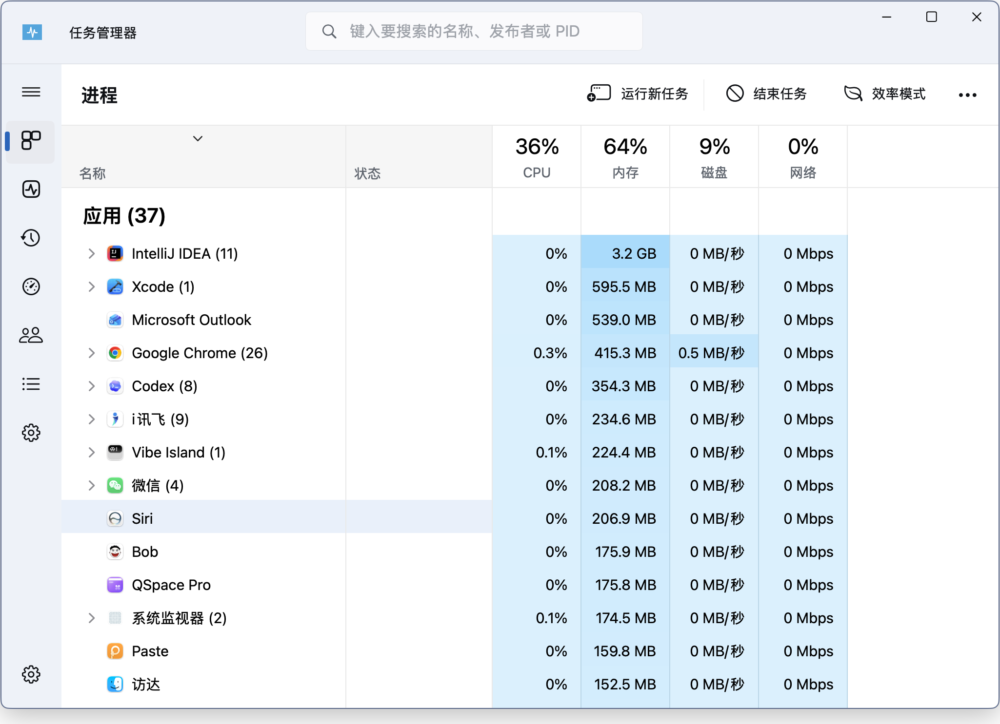

# MacSystemMonitor

A Windows Task Manager-inspired system monitor that runs natively on macOS.

> **This is not Windows.**
> The screenshot below is from a real macOS desktop. MacSystemMonitor is a native Mac app with a Windows Task Manager-style interface, not a Windows VM, not Parallels, and not a remote desktop session.
>
> **这不是 Windows 里的截图。** 这是运行在 macOS 上的原生应用，只是界面故意做成了 Windows 任务管理器的风格。



## Features

- Process list with CPU, memory, disk, and network activity.
- App and background process grouping.
- Expandable process rows for child processes.
- Search by process name, publisher/user, or PID.
- Run task, end task, and efficiency mode actions.
- macOS-native SwiftUI/AppKit implementation with a Windows Task Manager-inspired look.

## Build

Requirements:

- macOS
- Xcode Command Line Tools or a Swift toolchain

Build and package the app:

```sh
./build.sh
```

Run it:

```sh
open MacSystemMonitor.app
```

Or run the built executable directly:

```sh
./MacSystemMonitor
```

## Notes

MacSystemMonitor intentionally borrows the visual language of Windows Task Manager, but all process data comes from macOS system APIs and command line tools.
